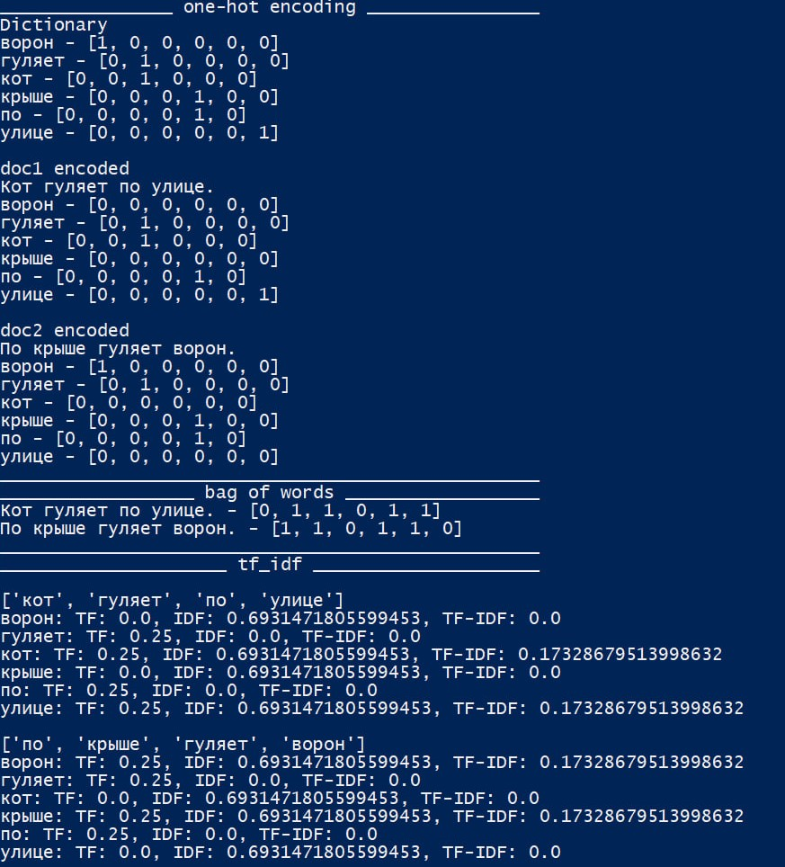

# NLP-Labs

# Лабораторная  1
Построить тремя способами векторную модель текста. Использовать прямое кодирование, мешок слов и TF-IDF.

# Лабораторная  2

Используя алгоритм векторизации TF-IDF, выполнить бинарную классификацию отзывов на положительные и отрицательные. Для этого: обучить логистическую регрессионную модель на тестовом множестве, используйте метод кросс-валидации.

# Лабораторная  3
Реализовать многослойную рекуррентную нейронную сеть для смыслового анализа рецензий на фильмы IMDb.

Использовать пакетное обучение RNN.

Применять слой LSTM для учета долгосрочных эффектов. Поместить слой LSTM внутрь оболочки Bidirectional.

# Лабораторная  4
Телеграм бот на основе языковой модели.

Доступные команды:

`/start` - список доступных команд

`/model` - название используемой модели

`/clear` - очистка контекста пользователя

[Видео к лабораторной 4]( docs/vid/lab4.mp4)